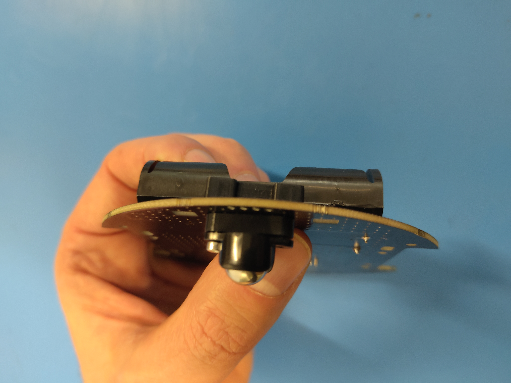

# DotBot Assembling manual

This document will guide you through the DotBot assembling workflow.

## Material & Tools

Make sure you have all required [components](./COMPONENTS.md).

You will all also need access to a soldering station and an Allen screen
driver (1.5mm). A pair of precision pliers are also useful to insert the
threaded insert in the 3D printed parts, see below.

## Prepare the PCBs

2 things must be soldered manually on the main DotBot PCB:
- the battery holder. This one is pretty straight forward
- the 2 pins micro JST **male** connectors for the left and right motors.
  **Be careful, they must be correctly oriented.** (The footprint drawn on the
  silkscreen is here to guide you)

Once the battery holder and the JST male connectors are soldered, you should have the
following result:

  

## Prepare the 3D printed parts

The threaded inserts have to be inserted inside the 2 motor holders and inside
the ball caster holder. This is done using the tip of the soldering station:

  

A placed threaded insert looks like this:

  

Once done, the motor and ball caster holders look like this:

  

## Prepare the DC motors

Both left and right motors have to be soldered to the cables of the 2 pins micro
JST female connectors. Here again, it is very important to follow the right
orientation:
- For the **right** motor, the `+` pad must be soldered to the **red** wire of the JST
  connector and the other pad to the black wire:
  

    
  

- For the **left** motor, the `+` pad must be soldered to the **black** wire of the JST
  connector and the other pad to the red wire:
  

    
  

Then you can place the magnetic encoder disks on both motor encoder shafts.

## Assemble all components together

At this point, you should have all components ready in front of you:

  

There are 3 remaining steps:

1. Mount the ball caster. For this step, you need:
  - 2x 10mm M2 screws
  - 1x Pololu ball caster
  - 1x Pololu ball caster holder
  - 1x Pololu ball caster spacer

  

    
  

  Once done it should look like this:

  

    
  

2. Mount the motors. For this step, you need:
  - 4x 5mm M2 screws
  - 2x motor holders
  - 1x left motor (the one with the **black** wire soldered on the `+` pad)
  - 1x right motor (the one with the **red** wire soldered on the `+` pad)

  1. Place one of the motor in the holder, on the corresponding side (left or
    right) of the PCB. It is important that the red wire is on **top** and on the
    **read** side, regardless if it's the right or left motor:
    

      
    

  2. Screw the motor:
    

      
    

  3. Repeat the operation for the other motor. You should end up with the
     following setup:
    

      
    

3. And last but not least, plug the JST connectors and put the wheels on the
  motor shafts and you are done!

  

