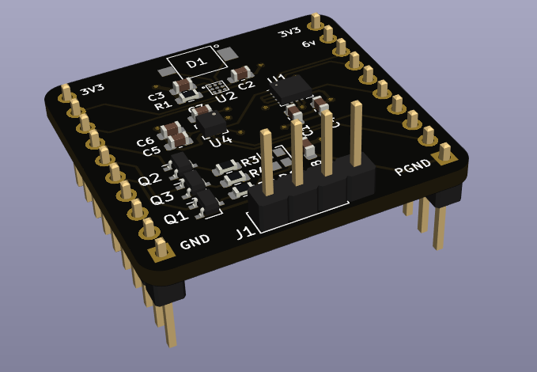
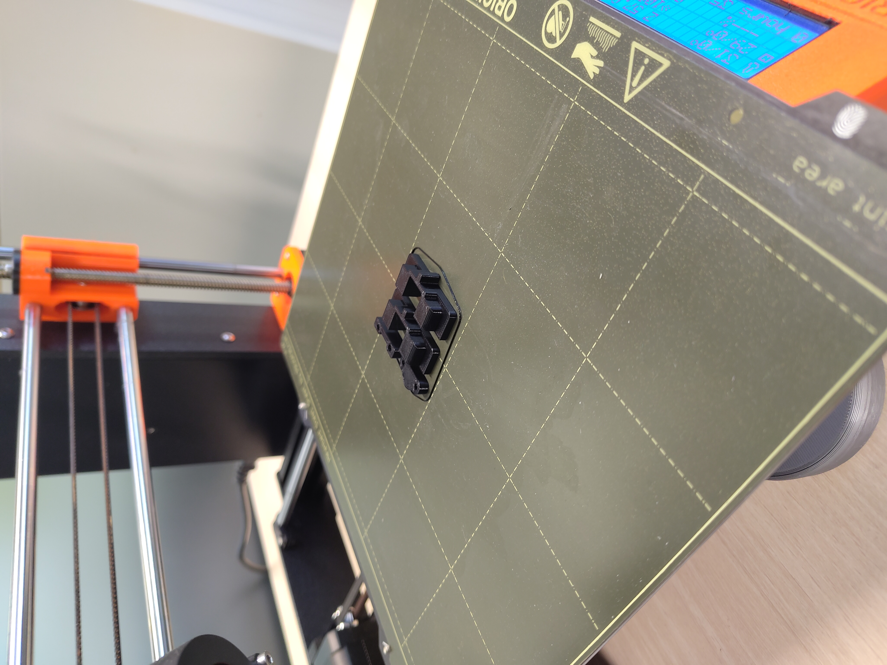

# DotBot required components

## PCBs

- 1x main PCB that you have to manufacture only. Some manufacturers offers
  complete manufacturing that includes PCB and assembling the electronic
  components. So you end-up with this:
  

    
  

- (optional) 1x LH2 shield PCB

  

    
  

## 3D printed parts

For the first 3, you can also use the [3D manufacturing file](parts/DotBot-parts.3mf)
with your 3D printer (PLA) to print them.

  

- 2x PLA motor holders, [step file](parts/DotBot-motor-holder.stl)

- 1x PLA ball caster spacer, [step file](parts/DotBot-ball-caster-spacer.stl)

- 1x PLA ball caster holder, [step file](parts/DotBot-ball-caster-holder.stl)

- (optional) 2x PLA wheel rims, [step file](parts/DotBot-wheel-rim.stl), [3mf](parts/DotBot-wheel-rims.3mf)

- (optional) 2x TPE/TPU wheel tires, [step file](parts/DotBot-wheel-tire.stl), [3mf](parts/DotBot-wheel-rims.3mf)

## Pololu parts

- 2x Pololu 6V DC motors with 51:1 ratio, [Pololu](https://www.pololu.com/product/2379)

- 1x ball caster, [Pololu](https://www.pololu.com/product/951)

- 2x magnetic encoder disks, [Pololu](https://www.pololu.com/product/2599)

- (optional if not using the 3D printed wheels) 2x 40x7mm diameter wheels,
  [Pololu](https://www.pololu.com/product/1454)

## Other parts

- 6x threaded inserts, [Digikey](https://www.digikey.com/short/3n0vdhcv)

- 4x M2 5mm long Allen screws with cylindrical head

- 2x M2 10mm long Allen screws with cylindrical head

- 2x 2 pins micro JST 2.0 male/female connectors, [Amazon](https://a.co/d/23qn1P9)

## Estimated price

We give a rough estimation (as of end of 2023) of the total price of a DotBot
(unit price when mass producing 1k bots). Buying the motors or wheels on Pololu
is safe but is also more expensive. For motors, it is possible to find cheaper
and compatible alternatives with Chinese resellers. For wheels, 3D printing
them is possible (see [COMPONENTS](COMPONENTS.md#3d-printed-parts)), much
cheaper and fun.

| Component             | Unit price ($) | # |          Total |
| :-------------------- | -------------: | - | -------------: |
| main PCB components   |          28.10 | 1 |          28.10 |
| main PCB fab          |           5.00 | 1 |           5.00 |
| shield PCB components |          18.65 | 1 |          18.65 |
| shield PCB fab        |           1.00 | 1 |           1.00 |
| motor                 |          16.31 | 2 |          32.62 |
| motor (china)         |           3.00 | 2 |           6.00 |
| ball caster           |           1.94 | 1 |           1.94 |
| magnetic disk         |           0.45 | 2 |           0.90 |
| JST connector         |           0.42 | 2 |           0.84 |
| wheel (pair)          |           4.19 | 1 |           4.19 |
| 5mm screw             |           0.15 | 4 |           0.60 |
| 10mm screw            |           0.15 | 2 |           0.30 |
| threaded inserts      |           0.10 | 6 |           0.60 |
|                       |                |   | Total 1: 44.28 |
|                       |                |   | Total 2: 63.93 |
|                       |                |   | Total 3: 75.09 |
|                       |                |   | Total 4: 94.74 |

- **Total 1**: main PCB only, 3D printed wheels, chinese motors
- **Total 2**: main and shield PCBs, 3D printed wheels, chinese motors
- **Total 3**: main PCB only, Pololu motors and wheels
- **Total 4**: main and shield PCBs, Pololu motors and wheels
