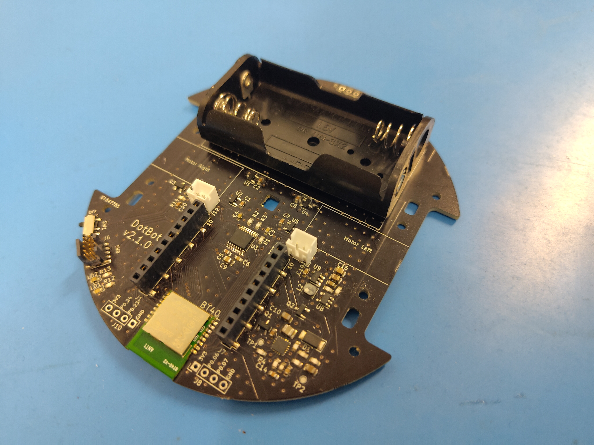
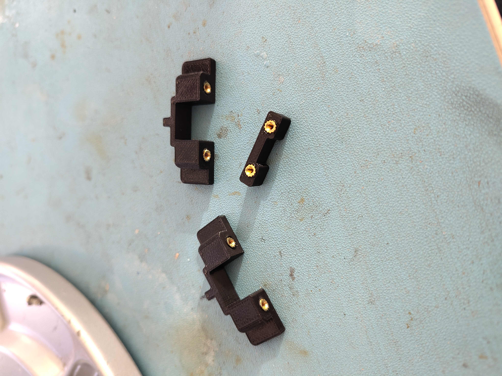
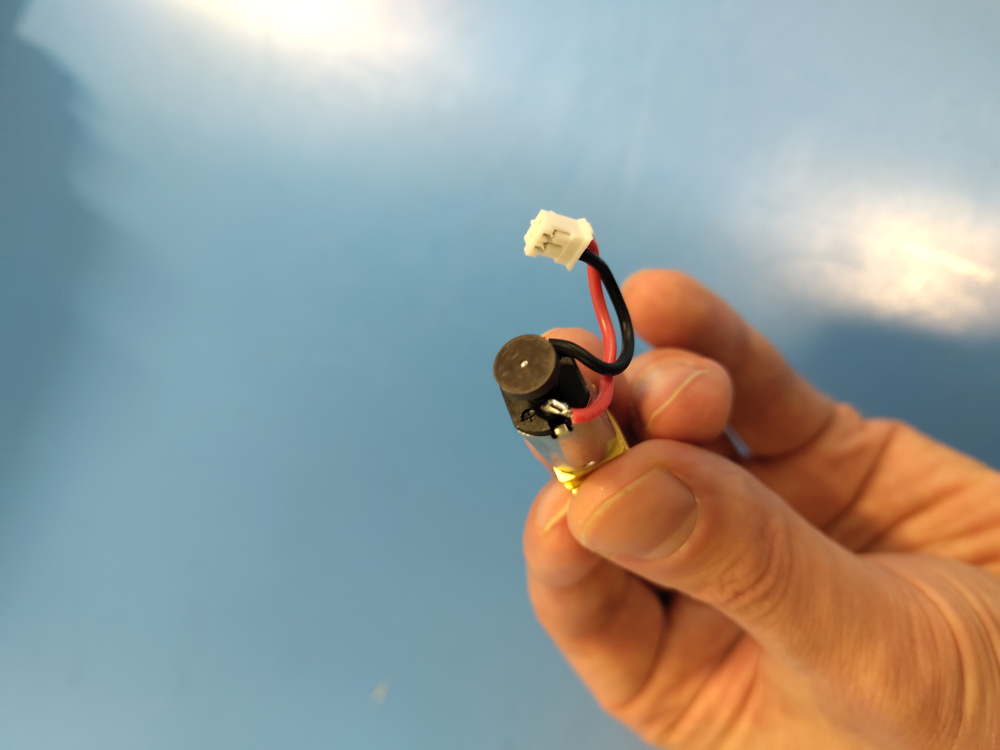
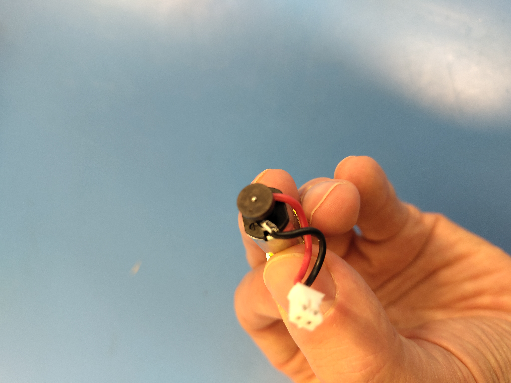

# Preliminary preparation

Some components have to be prepared before assembling the DotBot.

## Material & Tools

Make sure you have all required [components](./COMPONENTS.md).

You will all need access to a soldering station and to an Allen screwdriver
(1.5mm). A pair of precision pliers are also useful to insert the
threaded insert in the 3D printed parts, see below.

## Prepare the PCBs

2 things must be soldered manually on the main DotBot PCB:
- the battery holder. This one is pretty straight forward
- the 2 pins micro JST **male** connectors for the left and right motors.
  **Be careful, they must be correctly oriented.** (The footprint drawn on the
  silkscreen is here to guide you)

Once the battery holder and the JST male connectors are soldered, you should have the
following result:

  

## Prepare the 3D printed parts

The threaded inserts have to be inserted inside the 2 motor holders and inside
the ball caster holder. This is done using the tip of the soldering station:

  

A placed threaded insert looks like this:

  

Once done, the motor and ball caster holders look like this:

  

## Prepare the DC motors

Both left and right motors have to be soldered to the cables of the 2 pins micro
JST female connectors. Here again, it is very important to follow the right
orientation:
- For the **right** motor, the `+` pad must be soldered to the **red** wire of the JST
  connector and the other pad to the black wire:
  

    
  

- For the **left** motor, the `+` pad must be soldered to the **black** wire of the JST
  connector and the other pad to the red wire:
  

    
  

Then you can place the magnetic encoder disks on both motor encoder shafts.

You are now ready for [assembling your DotBot](ASSEMBLING.md).
